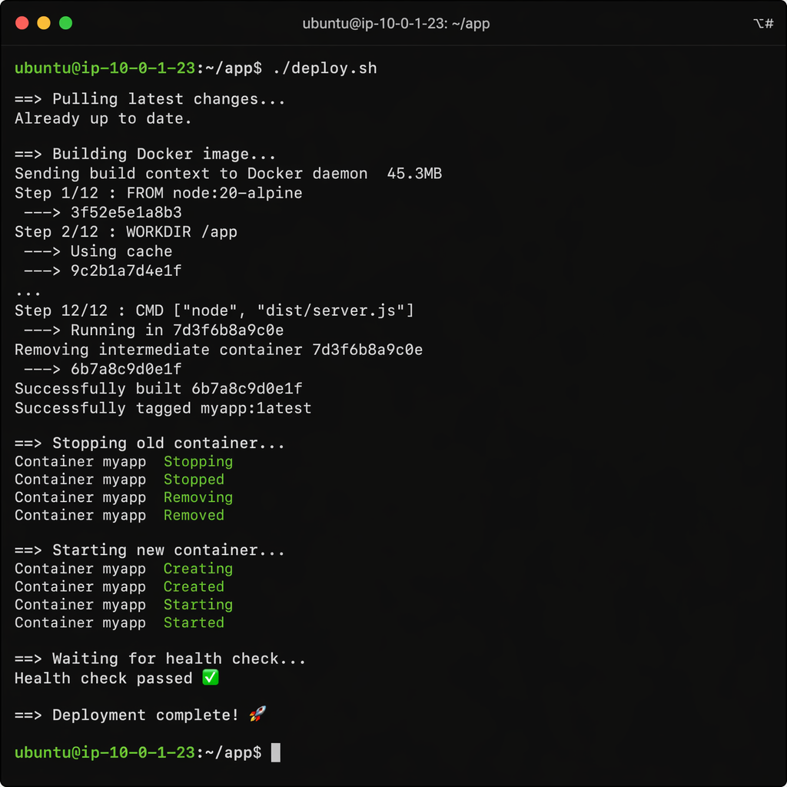

## First Impression of JavaScript and TypeScript
As someone who comes from a background who has done coding in C/C++, Python, and Java, learning both JavaScript and TypeScript is mostly not that difficult. The syntax is mostly similar to the C language family and Java. Though, there are some parts that I found way different from the other programming languages I used. I discovered that there are more than one way to implement functions in this language. It's one of those syntaxes that might take a while to get used to when coming from the C family and Python. I also noticed that both JavaScript and TypeScript have so-called `objects`, which resemble the nearly the same syntax as Python's dictionary. However, there are other JavaScript and TypeScript features I dislike, such as the following:

```javascript
0 == null // false
"" == null // false
false == null // false
5 == "5" // true
true == 1 // true
false == 0 // true
```

Using the triple equal signs `===` makes the comparison behave like the other programming languages. But I do think it would be better if it only used this `==`, and behaved like the other.

## My Thoughts on TypeScript’s Type 
As for TypeScript alone, it's basically just JavaScript with extra type checking, which reminds me of Python's optional type checking. Don't get me wrong, this idea is really good for catching bugs early on. However, it does make it longer, and sometimes more difficult to write, than writing pure JavaScript due to extra type keyword syntax and TypeScript’s strict type checking that prevents you from compiling to JavaScript. I think this language is definitely fitting for teaching the fundamentals of Software Engineering, since it also teaches you Web Development, especially with the addition of HTML and CSS as UI. Though, other languages like C# and Python work as well.

## Athletic Software Engineering
As for the Athletic Software Engineering, the idea is basically teaching students to learn tech skills by giving them high-intensity, time-constrained technical coding exercises called WOD (Workouts of the Day). The goal is to prepare students to be competent with the tools, before they actually start building or doing real Software Engineering tasks, such as building an app. I think I agree with this since it is important to actually be fluent with the tools and the development environment first, to develop a working Software. While I don't do coding exercises daily, I did manage to get through the two WOD, albeit, it's not the most optimized solution. I would think, the WOD would be even more stressful, if it included Leetcode-level coding solutions where you must come up with optimized solutions, which is not required for WOD. The course definitely also has new assignments that are due every day, which I find a bit stressful and different from the other courses I have taken, which have assignments due either once a week or twice a week. Though, it may take some time to get used to it.

## Conclusion
Overall, I find learning JavaScript and TypeScript interesting and a fitting language for teaching Software Engineering because it does overlap with Web Development and allows you to use HTML and CSS for learning UI. Other programming languages like C# and Python work as well. The Athletic Software Engineering is a new learning experience for me. They may be stressful in the future, but the learning through this might still be worth it. Additionally, I may need some time to get used to this class structure.
