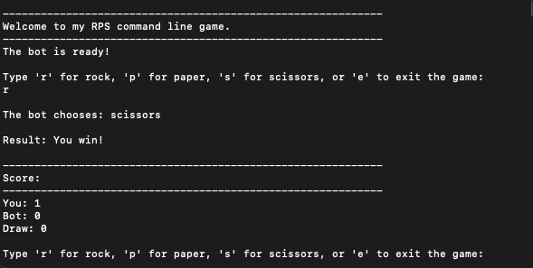

<div class="text-center p-4">
  
</div>

During my time in community college, I built a command line Rock-Paper-Scissors game in Java, as a practice for an exam. This project actually took me a while to dig up from an old hard drive, but I wanted to include it to show my early foundational work. The game runs entirely in the terminal. When running the program, the player will be greeted with a welcome message before facing the computer bot, which relies mostly on RNG to choose its moves. The game runs continuously using a while loop, until the user types in 'e' to exit out of the game.

Developing this simple project game taught me how to handle a game state using variables to keep track of scores across multiple rounds, and how to format the output. It did feel a little bit stressful at first, due to the Java syntax. But at the end, it felt satisfying to complete it.

Here is the snippet:
```java
import java.util.Scanner;
import java.util.Random;

/**
 * A very simple command-line game of the Rock-Paper-Scissors.
 * 
 * The game allows a user to play against a computer bot that relies on RNG choice. 
 * The game keeps track of scores and displays statistics throughout the session
 * 
 */
public class RPSGame {
    public static void main(String[] args) {
        Scanner scanner = new Scanner(System.in);
        Random random = new Random();

        int userScore = 0;
        int botScore = 0;
        int drawScore = 0;

        // Welcome screen
        System.out.println("------------------------------------------------------------");
        System.out.println("Welcome to my RPS command line game.");
        System.out.println("------------------------------------------------------------");
        System.out.println("The bot is ready!");
        System.out.println();

        while (true) {
            // Get user input
            System.out.println("Type 'r' for rock, 'p' for paper, 's' for scissors, or 'e' to exit the game:");
            String input = scanner.nextLine().trim().toLowerCase();

            // Check for 'e' aka exit
            if (input.equals("e")) {
                break;
            }

            // Validate user's input
            if (!input.equals("r") && !input.equals("p") && !input.equals("s")) {
                System.out.println("Invalid input! Please try again.");
                System.out.println();
                continue;
            }

            // Generate RNG bot choice (0 = rock, 1 = paper, 2 = scissors)
            int botNumber = random.nextInt(3);
            String botChoice;
            if (botNumber == 0) {
                botChoice = "rock";
            } else if (botNumber == 1) {
                botChoice = "paper";
            } else {
                botChoice = "scissors";
            }

            // Convert user input to full word
            String userChoice;
            if (input.equals("r")) {
                userChoice = "rock";
            } else if (input.equals("p")) {
                userChoice = "paper";
            } else {
                userChoice = "scissors";
            }

            // Determine the winner of this match
            String result;
            if (userChoice.equals(botChoice)) {
                result = "It's a draw!";
                drawScore++;
            } else if ((userChoice.equals("rock") && botChoice.equals("scissors")) ||
                       (userChoice.equals("paper") && botChoice.equals("rock")) ||
                       (userChoice.equals("scissors") && botChoice.equals("paper"))) {
                result = "You win!";
                userScore++;
            } else {
                result = "Bot wins!";
                botScore++;
            }

            // Display round results
            System.out.println();
            System.out.println("The bot chooses: " + botChoice);
            System.out.println();
            System.out.println("Result: " + result);
            System.out.println();

            // Display scoreboard
            System.out.println("------------------------------------------------------------");
            System.out.println("Score:");
            System.out.println("------------------------------------------------------------");
            System.out.println("You: " + userScore);
            System.out.println("Bot: " + botScore);
            System.out.println("Draw: " + drawScore);
            System.out.println();
        }

        // Show the final score screen
        System.out.println("------------------------------------------");
        System.out.println("The final score:");
        System.out.println("------------------------------------------");
        System.out.println("You: + userScore");
        System.out.println("Bot " + botScore);
        System.out.println("Draw: " + drawScore);
        System.out.println("------------------------------------------");
        System.out.println("Thank you for playing!");
        System.out.println("The game will exit shortly.");

        scanner.close();
    }
}
```
